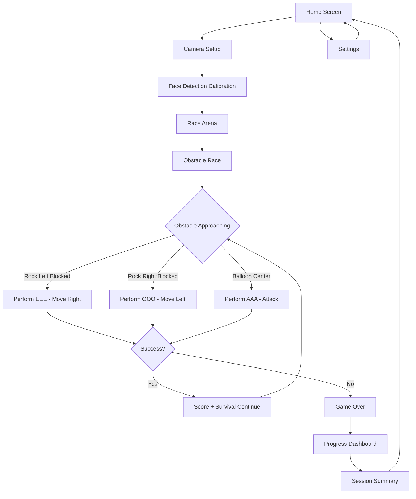

# Face Training Obstacle Race App - Product Requirements Document

## 1. Product Overview
A gamified face exercise app that uses real-time camera detection to recognize mouth shapes and translates them into bird movements in an obstacle race game, promoting facial muscle training for health and wellness.

The app transforms traditional face yoga exercises into an engaging survival game where players control a bird using mouth shapes (EEE, OOO, AAA) to dodge falling obstacles and destroy balloons, targeting users who want to improve facial muscle control through interactive gameplay.

This innovative approach combines face training with arcade-style gaming mechanics, making facial exercises more entertaining and motivating for long-term practice.

## 2. Core Features

### 2.1 User Roles
| Role | Registration Method | Core Permissions |
|------|---------------------|------------------|
| Player | Quick start (no registration required) | Can play game, view session stats |
| Registered User | Email registration | Can save progress, track long-term stats, unlock achievements |

### 2.2 Feature Module
Our Face Training Obstacle Race App consists of the following main pages:
1. **Home Screen**: iPhone-style interface with game start, progress overview, and settings access
2. **Camera Setup**: Camera permission request, face detection calibration, and exercise instructions
3. **Race Arena**: Real-time obstacle race with bird movement, falling rocks/balloons, and face yoga controls
4. **Progress Dashboard**: Exercise statistics, survival time records, and training history
5. **Settings**: Camera preferences, difficulty levels, and tutorial access

### 2.3 Page Details
| Page Name | Module Name | Feature description |
|-----------|-------------|---------------------|
| Home Screen | Welcome Interface | Display app logo, start game button, best survival time record |
| Home Screen | Quick Stats | Show today's play time, total successful movements, and personal best |
| Camera Setup | Permission Handler | Request camera access with clear explanation of usage |
| Camera Setup | Face Detection | Initialize face tracking, display face outline guide for proper positioning |
| Camera Setup | Exercise Tutorial | Show mouth shape examples with visual guides for "EEE", "OOO", "AAA" positions |
| Race Arena | Bird Character | Render animated bird at bottom center, smooth left/right movement animations |
| Race Arena | Obstacle System | Generate falling rocks and balloons from top, collision detection with bird |
| Race Arena | Movement Controls | Map "EEE" to move left, "OOO" to move right, "AAA" to attack/destroy balloons |
| Race Arena | Real-time Detection | Continuously analyze mouth shapes and trigger corresponding movements within 3 seconds |
| Race Arena | Game Over Logic | End game on collision with rock, wrong exercise, or timeout; show final score |
| Race Arena | Scoring System | Track successful movements, survival time, and display real-time score |
| Progress Dashboard | Session Summary | Show survival time, successful movements, accuracy rate, and score breakdown |
| Progress Dashboard | Achievement System | Display survival time records, movement mastery badges, and personal bests |
| Progress Dashboard | Historical Data | Present daily/weekly survival trends and exercise improvement charts |
| Settings | Camera Controls | Adjust camera sensitivity, mirror mode, and detection threshold |
| Settings | Game Difficulty | Set obstacle falling speed, spawn frequency, and timeout duration |
| Settings | Tutorial Access | Replay onboarding, view exercise guides, and tips for better detection |

## 3. Core Process

**Main User Flow:**
1. User opens app and sees iPhone-style home screen
2. Taps "Start Race" to begin obstacle race session
3. App requests camera permission and initializes face detection
4. User follows calibration guide to position face correctly
5. Bird character appears at bottom center of screen
6. Obstacles (rocks and balloons) begin falling from top of screen
7. User performs mouth shapes: "EEE" moves bird left, "OOO" moves bird right, "AAA" attacks balloons
8. Each successful shape recognition triggers corresponding movement within 3-second window
9. Game continues until bird hits rock, wrong exercise performed, or timeout occurs
10. Session ends showing survival time, score, and progress summary

**Registered User Flow:**
1. User creates account to save progress
2. Unlocks achievement system and long-term tracking
3. Can set personal goals and view historical data
4. Receives personalized recommendations for exercise improvement

## 4. User Interface Design

### 4.1 Design Style
- **Primary Colors**: Sky blue (#87CEEB) for bird character, vibrant green (#4CAF50) for success/health
- **Secondary Colors**: Gray rocks (#808080), colorful balloons (#FF6B6B, #4ECDC4, #45B7D1), red (#F44336) for game over
- **Button Style**: Rounded corners with subtle shadows, iOS-style design language
- **Font**: San Francisco (iOS system font) or Roboto fallback, sizes 14px-24px for readability
- **Layout Style**: Vertical scrolling game area with clean spacing, top navigation with back buttons
- **Icons**: Playful emoji-style icons (🐦 for bird, 🪨 for rocks, 🎈 for balloons, 📸 for camera)

### 4.2 Page Design Overview
| Page Name | Module Name | UI Elements |
|-----------|-------------|-------------|
| Home Screen | Welcome Interface | Large gradient background, centered app logo, prominent "Start Race" button with glow effect |
| Home Screen | Quick Stats | Horizontal card layout with icons, survival time records, best score display |
| Camera Setup | Permission Handler | Modal overlay with camera icon, friendly explanation text, "Allow Camera" button |
| Camera Setup | Face Detection | Live camera feed with overlay guide, green border when face detected, instruction text below |
| Race Arena | Bird Character | Animated bird sprite at bottom center, smooth left/right movement animations |
| Race Arena | Obstacle System | Falling rocks and balloons from top, collision detection visual feedback |
| Race Arena | Movement Controls | Real-time mouth shape recognition display, movement indicators, 3-second timeout warning |
| Race Arena | Game Over Screen | Survival time display, final score, restart button, return to home option |
| Progress Dashboard | Session Summary | Survival time charts, successful movement counters, accuracy percentages |
| Settings | Camera Controls | Toggle switches, slider controls, preview window for camera adjustments |

### 4.3 Responsiveness
The app is designed mobile-first with iPhone screen proportions (375x812px), featuring touch-optimized interactions and responsive scaling for different screen sizes. All camera interactions are optimized for portrait orientation with intuitive gesture controls.