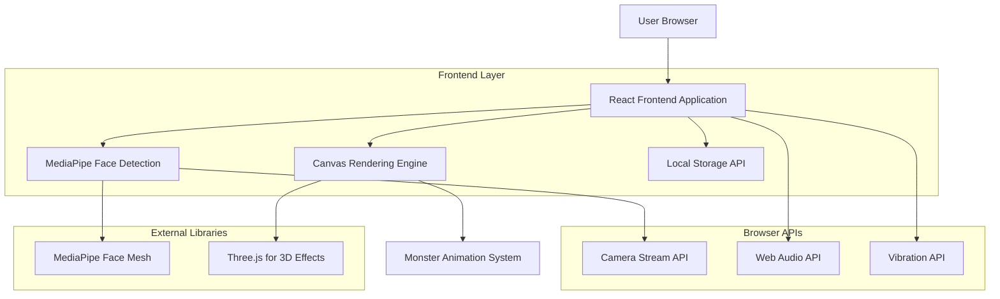
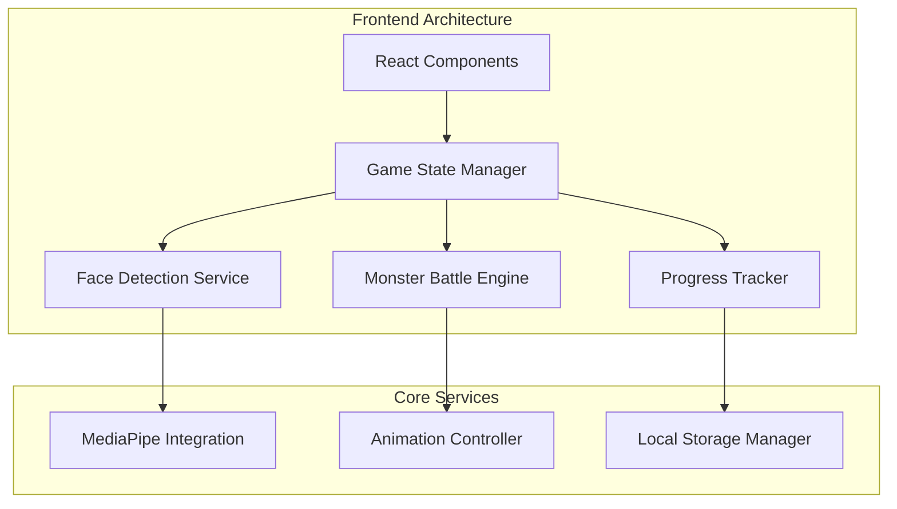
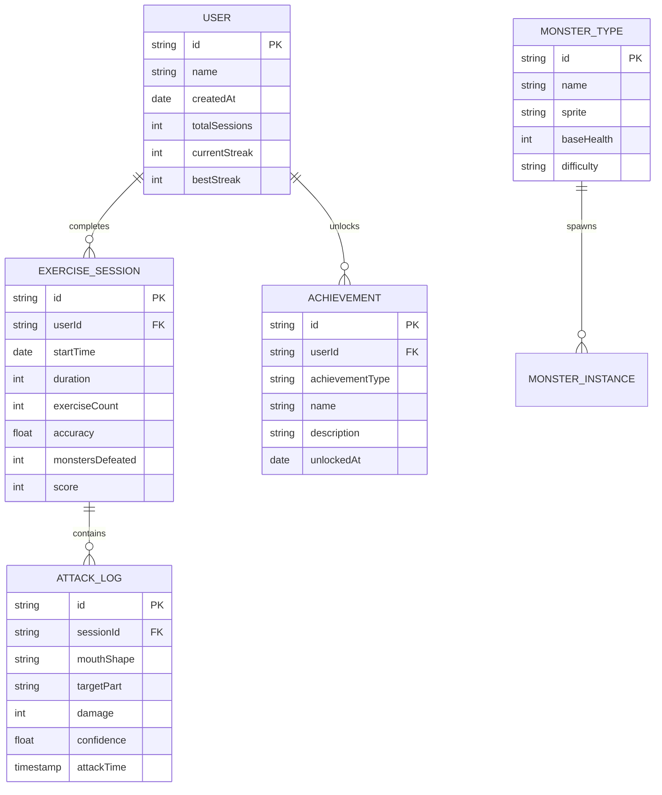

# Face Training Diet App - Technical Architecture Document

## 1. Architecture Design



## 2. Technology Description

* **Frontend**: React\@18 + TypeScript + Vite + Tailwind CSS

* **Face Detection**: MediaPipe Face Mesh + TensorFlow\.js

* **3D Graphics**: Three.js for monster animations and particle effects

* **State Management**: React Context API + useReducer for game state

* **Styling**: Tailwind CSS with custom iPhone-style components

* **Build Tool**: Vite for fast development and optimized production builds

## 3. Route Definitions

| Route     | Purpose                                                |
| --------- | ------------------------------------------------------ |
| /         | Home screen with game start and progress overview      |
| /setup    | Camera setup and face detection calibration            |
| /battle   | Main battle arena with real-time mouth shape detection |
| /progress | Progress dashboard with statistics and achievements    |
| /settings | App settings and camera configuration                  |
| /tutorial | Interactive tutorial for mouth shape exercises         |

## 4. API Definitions

### 4.1 Core APIs

**Face Detection Service**

```typescript
interface FaceDetectionResult {
  landmarks: number[][];
  mouthShape: 'aaa' | 'eee' | 'ooo' | 'neutral';
  confidence: number;
  boundingBox: {
    x: number;
    y: number;
    width: number;
    height: number;
  };
}

class FaceDetectionService {
  async initializeCamera(): Promise<MediaStream>;
  async detectFace(videoElement: HTMLVideoElement): Promise<FaceDetectionResult>;
  analyzeMouthShape(landmarks: number[][]): 'aaa' | 'eee' | 'ooo' | 'neutral';
}
```

**Game State Management**

```typescript
interface Monster {
  id: string;
  name: string;
  parts: {
    head: { health: number; maxHealth: number };
    leftArm: { health: number; maxHealth: number };
    rightArm: { health: number; maxHealth: number };
    legs: { health: number; maxHealth: number };
  };
  isDefeated: boolean;
}

interface GameState {
  currentMonster: Monster;
  score: number;
  streak: number;
  sessionStartTime: number;
  exerciseCount: number;
  accuracy: number;
}

interface AttackResult {
  damage: number;
  targetPart: keyof Monster['parts'];
  wasSuccessful: boolean;
  newHealth: number;
}
```

**Progress Tracking**

```typescript
interface ExerciseSession {
  id: string;
  date: Date;
  duration: number;
  exerciseCount: number;
  accuracy: number;
  monstersDefeated: number;
  caloriesEstimate: number;
}

interface Achievement {
  id: string;
  name: string;
  description: string;
  icon: string;
  isUnlocked: boolean;
  unlockedAt?: Date;
}
```

## 5. Server Architecture Diagram



## 6. Data Model

### 6.1 Data Model Definition



### 6.2 Data Definition Language

**Local Storage Schema (Browser-based storage)**

```typescript
// User Profile Storage
interface UserProfile {
  id: string;
  name: string;
  createdAt: string;
  totalSessions: number;
  currentStreak: number;
  bestStreak: number;
  totalExercises: number;
  totalMonstersDefeated: number;
}

// Exercise Sessions Storage
interface StoredSession {
  id: string;
  date: string;
  duration: number;
  exerciseCount: number;
  accuracy: number;
  monstersDefeated: number;
  score: number;
  attackLogs: AttackLog[];
}

// Settings Storage
interface AppSettings {
  cameraDeviceId?: string;
  detectionSensitivity: number;
  soundEnabled: boolean;
  vibrationEnabled: boolean;
  difficulty: 'easy' | 'medium' | 'hard';
  mirrorMode: boolean;
}

// Achievement Storage
interface StoredAchievement {
  id: string;
  type: string;
  unlockedAt: string;
  progress: number;
  isCompleted: boolean;
}

// Local Storage Keys
const STORAGE_KEYS = {
  USER_PROFILE: 'faceTraining_userProfile',
  SESSIONS: 'faceTraining_sessions',
  SETTINGS: 'faceTraining_settings',
  ACHIEVEMENTS: 'faceTraining_achievements',
  CURRENT_STREAK: 'faceTraining_currentStreak'
} as const;
```

**Initial Data Setup**

```typescript
// Default Monster Types
const DEFAULT_MONSTERS = [
  {
    id: 'goblin',
    name: 'Training Goblin',
    sprite: '/monsters/goblin.png',
    baseHealth: 100,
    difficulty: 'easy'
  },
  {
    id: 'orc',
    name: 'Muscle Orc',
    sprite: '/monsters/orc.png',
    baseHealth: 150,
    difficulty: 'medium'
  },
  {
    id: 'dragon',
    name: 'Face Dragon',
    sprite: '/monsters/dragon.png',
    baseHealth: 200,
    difficulty: 'hard'
  }
];

// Default Achievements
const DEFAULT_ACHIEVEMENTS = [
  {
    id: 'first_monster',
    name: 'First Victory',
    description: 'Defeat your first monster',
    icon: '🏆',
    requirement: { type: 'monstersDefeated', value: 1 }
  },
  {
    id: 'streak_7',
    name: 'Week Warrior',
    description: 'Exercise for 7 days in a row',
    icon: '🔥',
    requirement: { type: 'streak', value: 7 }
  },
  {
    id: 'accuracy_master',
    name: 'Precision Master',
    description: 'Achieve 90% accuracy in a session',
    icon: '🎯',
    requirement: { type: 'accuracy', value: 0.9 }
  }
];
```

